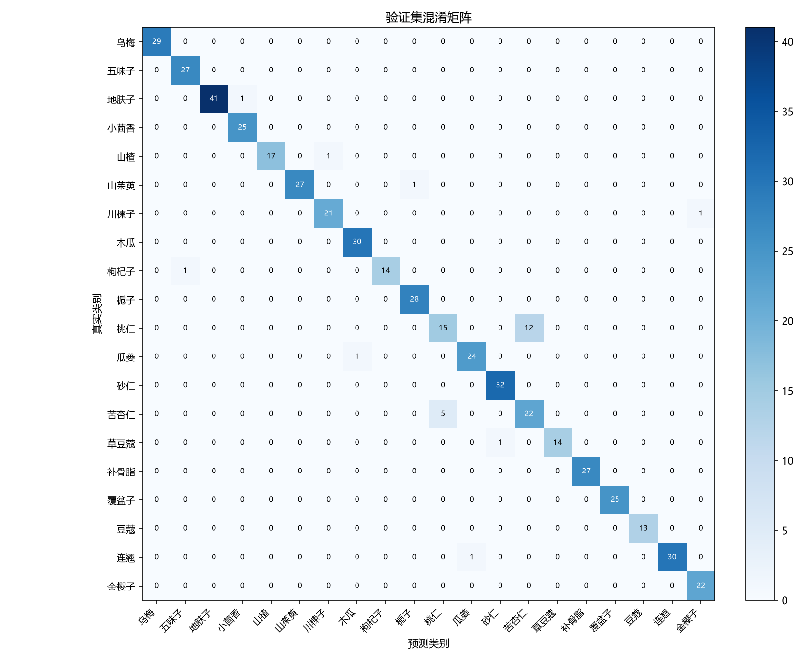
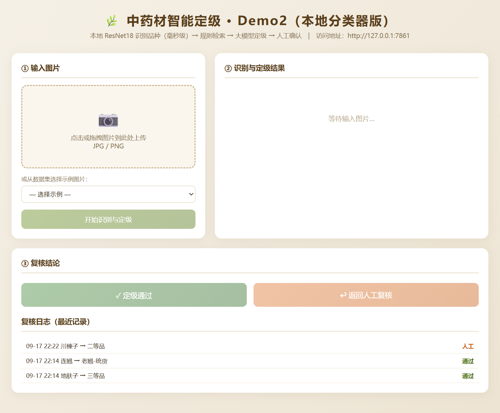
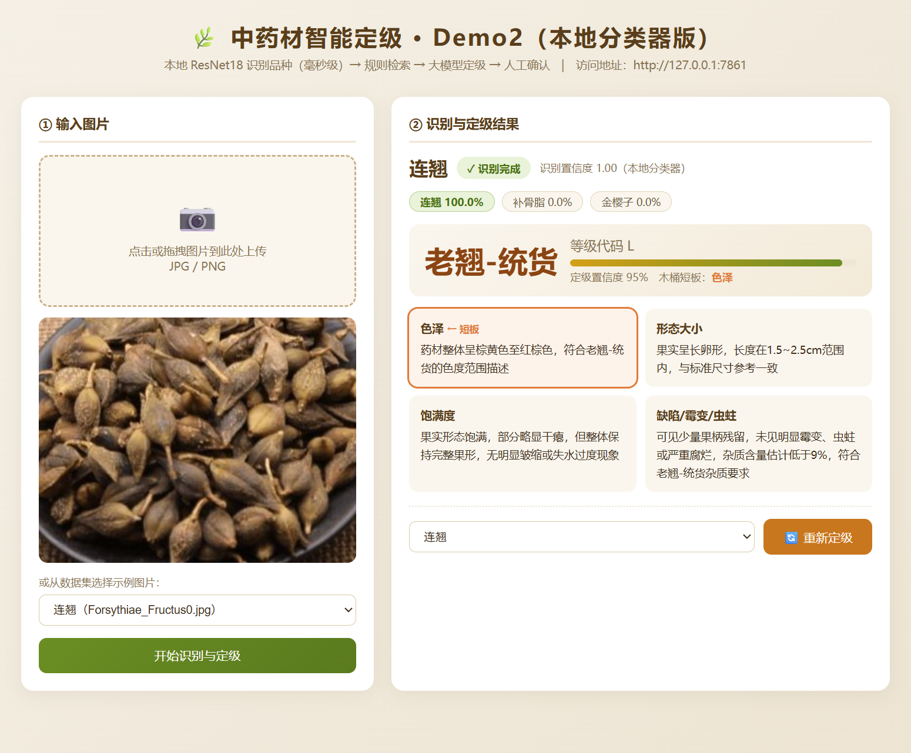
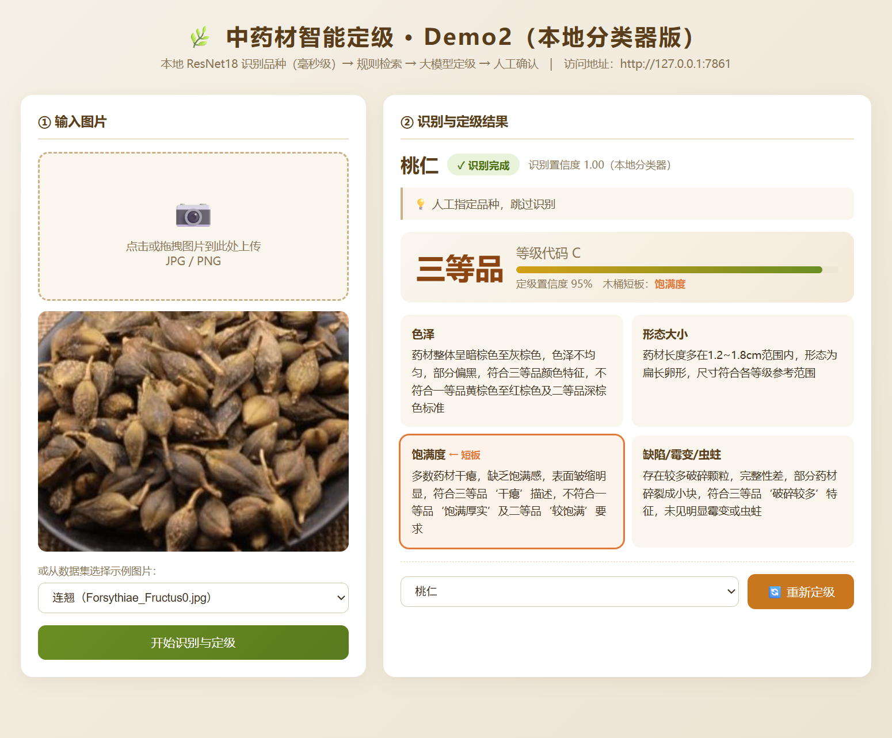
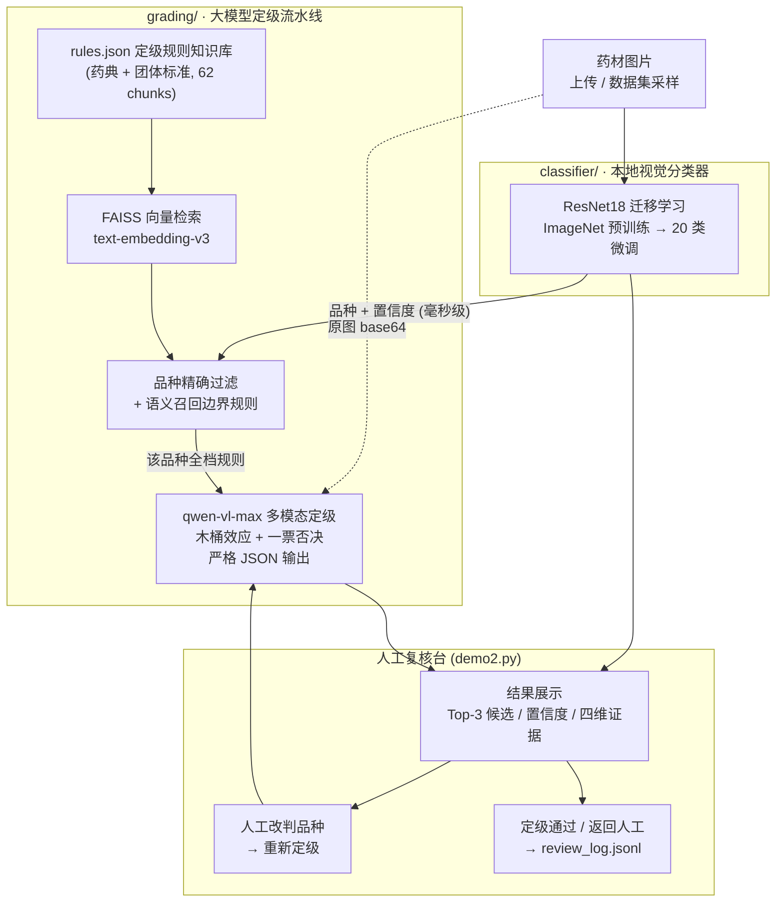

# tcm-grader · 中药材智能定级系统

针对 20 种果实类中药材的**品种识别 + 质量定级**系统，采用「小模型分类 + 大模型定级」混合架构：

- **本地 ResNet18 分类器**（迁移学习）负责品种识别——毫秒级、结果稳定、零 API 成本
- **多模态大模型**（qwen-vl-max）+ RAG 规则检索负责质量定级——可解释、按药典规则逐维度比对
- **Web 人工复核台**支持改判重定级与复核记录回流，形成完整业务闭环

## 效果

**品种分类器**（验证集 508 张，分层 85/15 划分，未参与训练）：

| 指标 | 数值 |
|---|---|
| Top-1 准确率 | **95.1%**（483/508） |
| Top-2 准确率 | **99.4%** |
| Macro F1 / Weighted F1 | 0.951 / 0.950 |
| 各类别表现 | 20 类中 18 类 F1 ≥ 0.95，其中 8 类 F1 = 1.0 |

混淆矩阵：



**定级推理**：输出等级（特优级/特级/甲级/乙级/等外品）、置信度、四维度（色泽/形态大小/饱满度/缺陷）证据与木桶短板维度，基准结果见 [docs/benchmarks/](docs/benchmarks/)。

## 运行示例

**首页**：选择数据集示例图片或上传图片：



**识别与定级**：本地分类器识别品种（含 Top-3 候选与置信度）→ 大模型输出等级与四维证据：



**人工改判**：品种识别错误时（如易混的连翘/桃仁场景），下拉更正品种后一键重新定级：



## 架构



**为什么不让大模型直接识别品种？** 基准测试发现大模型识别存在系统性误判（如去皮桃仁持续被认成苦杏仁），且每次识别多花 30 秒与一份 API 费用；本地分类器 Top-1 95.1% 且毫秒级返回。而定级需要理解规则条文、做多维度证据推理，是语义任务，保留给大模型。两类模型各用所长，单张图片的大模型调用量从 2 次降为 1 次。

## 目录结构

```
tcm-grader/
├── grading/                  # 大模型定级流水线
│   ├── 00_copy_dataset.py        # 整理原始数据集（拉丁名 → 中文名文件夹）
│   ├── 01_build_knowledge_base.py# 构建 FAISS 向量知识库
│   ├── 02_retrieve_rules.py      # 规则检索模块（RuleRetriever）
│   ├── 03_grade_herbs.py         # 两阶段推理：品种识别 + 定级
│   ├── 04_evaluate.py            # 定级结果评估
│   ├── 05_diagnose_rag.py        # 检索质量诊断
│   ├── 06_benchmark.py           # 批量基准测试
│   ├── 07_parse_benchmark.py     # 基准结果解析
│   ├── 08_demo_process.py        # 命令行单图演示
│   ├── 09_test_error_prone.py    # 易混淆样本定向测试
│   ├── 10_review_demo.py         # 人工复核台（纯大模型识别版, 端口 7860）
│   ├── config.py                 # 全局配置
│   └── data/
│       ├── rules.json            # 定级规则知识库源数据（20 种药材）
│       └── NB-TCM-CHM/           # 图片数据集（自备, 不入库）
├── classifier/               # 本地视觉分类器 + 混合架构
│   ├── train_classifier.py       # 分类器训练（ResNet18 迁移学习）
│   ├── predict.py                # 单图/文件夹批量预测
│   ├── gradehub.py               # 定级调度中心（分类器 → 检索 → 大模型）
│   ├── demo2.py                  # 人工复核台（本地分类器版, 端口 7861）
│   └── outputs/                  # 模型权重（自训）与评估产物
└── docs/
    ├── PRD.md                    # 产品设计文档
    └── benchmarks/               # 基准测试产物
```

## 快速开始

### 1. 安装依赖

```bash
pip install -r requirements.txt
# GPU 用户建议安装 CUDA 版 torch（约 2.5GB）：
pip install torch torchvision --index-url https://download.pytorch.org/whl/cu126
```

### 2. 配置 API Key

```bash
cp .env.example grading/.env
# 编辑 grading/.env，填入你的 DASHSCOPE_API_KEY
```

### 3. 准备数据集

将图片数据集按「中文名文件夹」放置到 `grading/data/NB-TCM-CHM/`：

```
grading/data/NB-TCM-CHM/
├── 枸杞子/Lycii_Fructus0.jpg ...
├── 桃仁/Persicae_Semen0.jpg ...
└── ...（共 20 类）
```

若你的原始数据集是拉丁名文件夹（如 `Lycii_Fructus/`），放入 `data/Dataset_1_Cleaned/` 后运行：

```bash
python grading/00_copy_dataset.py
```

### 4. 构建知识库 + 训练分类器

```bash
cd grading
python 01_build_knowledge_base.py    # 62 chunks 入 FAISS，约 1 分钟

cd ../classifier
python train_classifier.py           # RTX 4060 约 5 分钟，CPU 亦可行
```

### 5. 启动复核台

```bash
# 推荐：混合架构版（本地分类器识别品种 + 大模型定级）
cd classifier
python demo2.py                      # http://127.0.0.1:7861

# 或：纯大模型版（两次大模型调用）
cd ../grading
python 10_review_demo.py             # http://127.0.0.1:7860
```

网页流程：选择/上传图片 → 自动识别品种（含 Top-3 候选与置信度）→ 大模型定级（四维证据 + 木桶短板）→ 可改判品种重新定级 → 定级通过 / 返回人工。

命令行方式：

```bash
python classifier/predict.py <图片路径或文件夹>          # 仅品种识别
python grading/08_demo_process.py --image <图片>         # 单图完整流程
```

## 已知问题与改进方向

- **桃仁 ↔ 苦杏仁互混**（分类器 F1 分别 0.64 / 0.72）：数据集中桃仁多为去皮炮制品，形态酷似苦杏仁。计划补充炮制品形态数据或细粒度特征。此问题在大模型识别基准中同样存在，且与人工复核结论一致——已作为典型案例写入识别 Prompt 的混淆要点。
- **定级依赖目测估计**：粒数、直径等量化指标由大模型目测，误差较大。计划引入检测/分割模型提取量化特征后再定级。
- **类别不均衡**：各类样本 87~280 张不等，当前未做加权；等外品（劣质药）负样本偏少。
- **模型权重不入库**：`best_model.pth` 约 43MB，请按第 4 步自行训练（数据集 + 5 分钟 GPU 即可复现）。

## 数据与许可说明

- 代码与 `rules.json` 定级规则基于《中国药典》、SB/T 11173-2016 及 T/CACM 1021 系列标准整理，MIT 许可发布。
- NB-TCM-CHM 图片数据集**不随本仓库分发**，请自行获取并遵守其原始许可。
